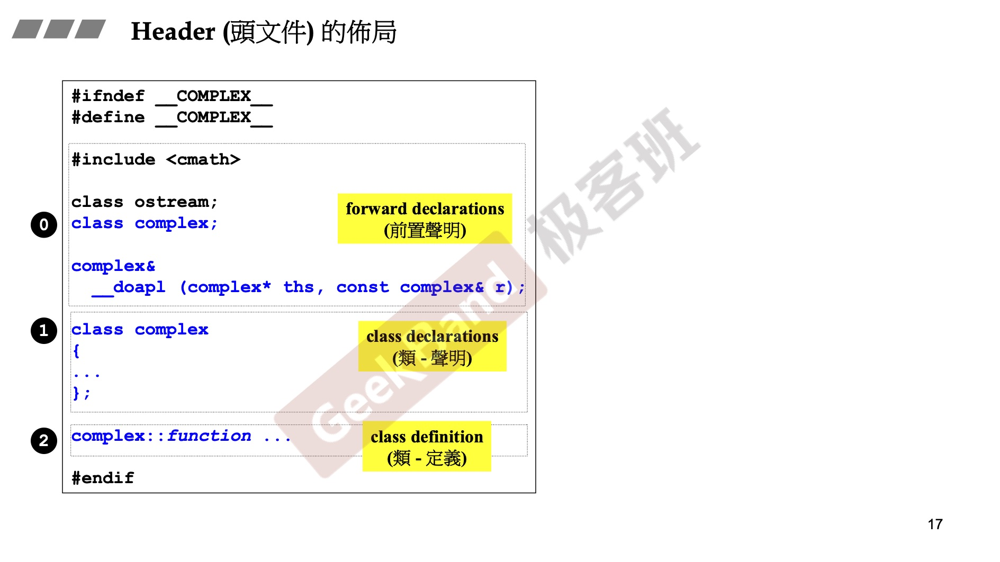
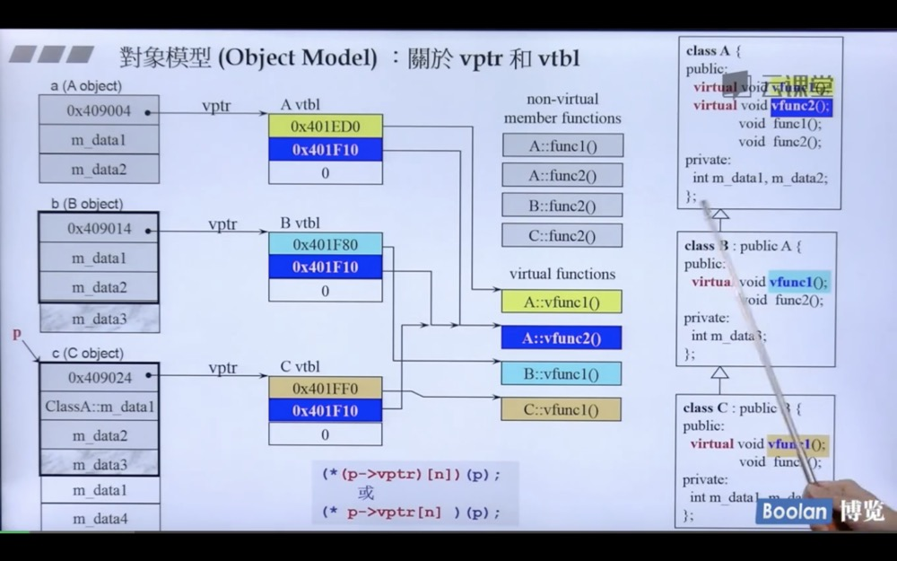
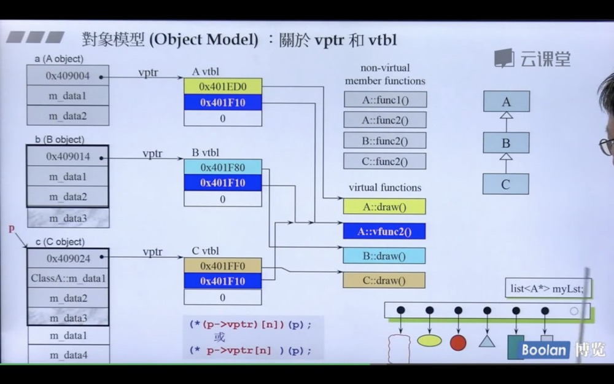
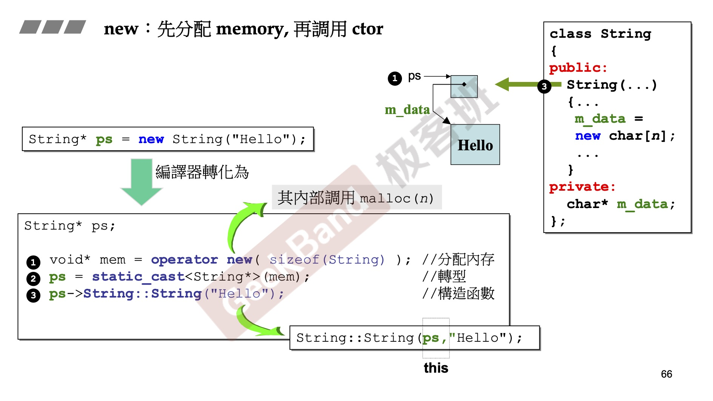
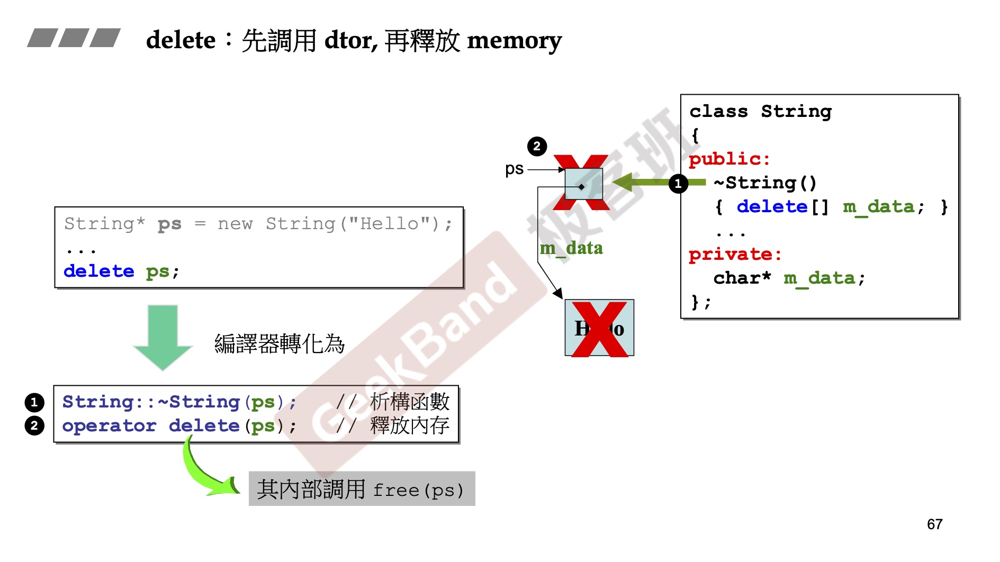
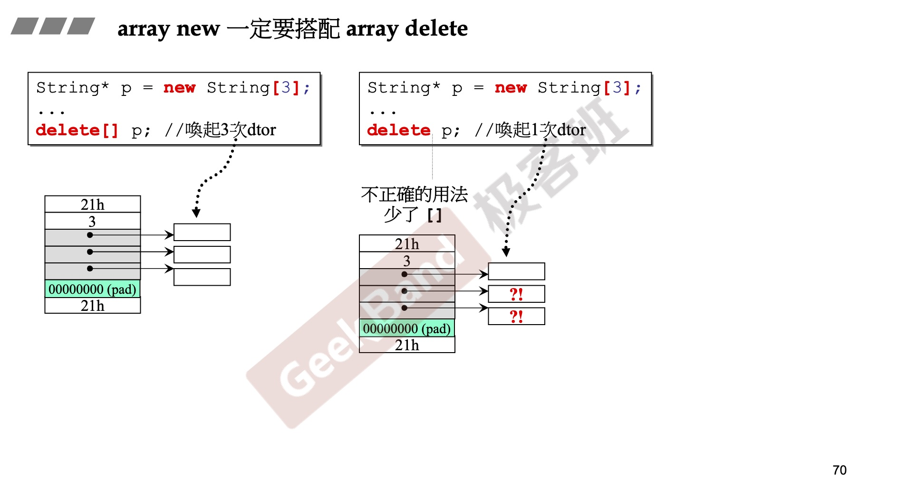

# C++ 代码练习

## 仓库内容
学习侯捷老师的关于c++的系列讲解，将视频中的代码写下，并在代码的适当地方填写解释

> 1. [侯捷C++手把手教学(上),适合新手](https://www.bilibili.com/video/BV1aW411H7Xa?p=1)
> 2. [侯捷手把手教学C++(下)已补充完毕](https://www.bilibili.com/video/BV1sW411J7JQ?p=1)
> 3. [侯捷——C++11新特性](https://www.bilibili.com/video/BV1p4411v7Dh?p=1)
> 4. [【C++】C++ STL与泛型编程高级-侯捷](https://www.bilibili.com/video/BV1Yb411p7UK?p=1)
> 5. [侯捷 讲解C++内存管理（全60集）](https://www.bilibili.com/video/BV1it411g776?p=1)


## 知识点目录

**C++入门**

1. [头文件和类的声明](#头文件和类的声明)

2. [内联函数](https://github.com/yangsoon/cpptest/blob/master/c%2B%2B/complex.h#L11)

3. [构造函数-初始列](https://github.com/yangsoon/cpptest/blob/master/c%2B%2B/complex.h#L9)

4. [单例模式](https://github.com/yangsoon/cpptest/blob/master/c%2B%2B/Singleton.h)

   > 使用static修饰的变量保证单例，ctor函数放在private内 避免其他用户可以直接调用构造函数

5. [常量(const)成员函数](https://github.com/yangsoon/cpptest/blob/master/c%2B%2B/complex.h#L13)

6. [友元函数](https://github.com/yangsoon/cpptest/blob/master/c%2B%2B/complex.h#L25)

   > 一个对象的成员函数是该类其他对象的[友元函数](https://github.com/yangsoon/cpptest/blob/master/c%2B%2B/complex.h#L18)

7. [操作符重载](https://github.com/yangsoon/cpptest/blob/master/c%2B%2B/complex.h#L40)(忘记了的话查看[视频](https://www.bilibili.com/video/BV1aW411H7Xa?p=5))

   > 操作符重载就是重新定义操作符对应的函数，其中重载之后的返回值需要仔细考虑
   >
   > 例如 c+=3 重载+=之后 如果返回c对应的类的话就可以执行 b+=c+=4 
   >
   > 例如 cout << b << c 重载 << 之后 返回osstream 这样能继续输出。

8. [深拷贝和浅拷贝](https://github.com/yangsoon/cpptest/blob/master/c%2B%2B/string.h)

9. [拷贝构造](https://github.com/yangsoon/cpptest/blob/master/c%2B%2B/string.h#L39)和[拷贝赋值](https://github.com/yangsoon/cpptest/blob/master/c%2B%2B/string.h#L50)

10. [带指针对象的析构函数](https://github.com/yangsoon/cpptest/blob/master/c%2B%2B/string.h#L68)

11. [static成员变量](https://github.com/yangsoon/cpptest/blob/master/c%2B%2B/account.h)

12. [类模板](https://github.com/yangsoon/cpptest/blob/master/c%2B%2B/template-com.h)和[函数模板](https://github.com/yangsoon/cpptest/blob/master/c%2B%2B/account-test.cpp#L21)

13. [类继承](https://github.com/yangsoon/cpptest/blob/master/c%2B%2B/oop-demo.h)

14. [设计模式](https://www.bilibili.com/video/BV1aW411H7Xa?p=13)

15. [转换函数conversion-function](https://github.com/yangsoon/cpptest/blob/master/c%2B%2B2/conversion-function.cpp)

16. [explicit用法](https://github.com/yangsoon/cpptest/blob/master/c%2B%2B2/conversion-function.cpp#L67)

    > explicit for ctors taking  one argument
    >
    > explicit for ctors taking more than one argument c++11

17. [pointer-like class](https://github.com/yangsoon/cpptest/blob/master/c%2B%2B2/pointer-like.cpp)

    > 补充智能指针的知识

18. [仿函数](https://github.com/yangsoon/cpptest/blob/master/c%2B%2B2/function-like.cpp)

    > 继续学习

19. [namespace](https://github.com/yangsoon/cpptest/blob/master/c%2B%2B2/namespace.cpp)

20. [成员模板](https://github.com/yangsoon/cpptest/blob/master/c%2B%2B2/member-templete.cpp)

21. [模板特化](https://github.com/yangsoon/cpptest/blob/master/c%2B%2B2/specialization.cpp)和[模板偏特化](https://github.com/yangsoon/cpptest/blob/master/c%2B%2B2/partial-specialization.cpp)

22. [引用](https://github.com/yangsoon/cpptest/blob/master/c%2B%2B2/reference.cpp)

23. [虚指针和虚表,动态绑定](#虚指针和虚表)

    > 当进行动态绑定的时候 就会安装下面的流程进行查找需要的函数,每个包含虚函数的对象在内存中都包含一个虚指针，这个指针是指向一个虚表 这个虚表可以看成一个数组 用来存这个对象的虚函数列表 然后依据虚函数的下标位置进行调用函数执行(*p->vptr[n])(p) 类似这样的调用

24. [new delete new[] delete[]](#new和delete)

25. [const](https://github.com/yangsoon/cpptest/blob/master/c%2B%2B2/const.cpp)

26. C++11 new [auto](https://github.com/yangsoon/cpptest/blob/master/c%2B%2B2/auto.cpp) [ranged-base](https://github.com/yangsoon/cpptest/blob/master/c%2B%2B2/ranged-base-for.cpp) 

27. [variadic-templates](https://github.com/yangsoon/cpptest/blob/master/c%2B%2B2/variadic-templates.cpp)

    > 详情看c++11部分

28. [重载new()和delete()](https://www.bilibili.com/video/BV1sW411J7JQ?p=2)

    重载new 每个声明都要有独特的参数列，`Foo* pf = new(300, 'a')Foo`也可以重载delete() 只有当new所调用的ctor抛出异常才会调用这些重载版本的delete()

**C++11/14**

1. variadic-templates

2. Space in Template Expressions

   ```c++
   vector<list<int> > 在每个版本都适用
   vector<list<int>>  c++11后可以
   ```

3. nullptr and std::nullptr_t

   ```c++
   // C++11之后指针可以用 nullptr代替 0 or NULL
   void f(int);
   void f(void*);
   f(0); // call f(int)
   f(NULL); // call f(int) if NULL is 0 ambiguous
   f(nullptr); // call f(void*)
   ```

4. auto

   ```c++
   // #1 c++11 you can declare a var or an object without specifiying type by using auto
   auto i = 42;
   double f();
   auto d = f();
   // #2 auto用于2种情况 第一种是type太长 另一种是复杂的表达式 lambda 
   vector<int> v;
   // vector<int>::iterator pos;
   // pos = v.begin();
   auto pos = v.begin();
   auto l = [](int x) -> bool{}
   ```

5. Uniform Initialization (一致性初始化)

   > 原理: 编译器看到大括号 {t1,t2,tn}变做出一个 Initializer_list<T> 他关联到一个array<T,n> 调用ctor的时候 array内的元素被编译器被逐一赋值给ctor
   >
   > 但如果参数参数是个Initializer_list<T> 那就将参数打包直接发给函数

   ```c++
   // 如何初始化一个对象或变量，c++11 之前 新手很容易困惑 初始化可能发生在() {} =操作符
   // c++11 后统一一个方法 用{}
   int a[] = {1,2,3,4};
   vector<int> v{2,3,4,5,6};
   vector<string> city {
     "New York", "London", "Beijing"
   };
   comlex<int> c{4.0, 3.0}; // 等价于 c(4.0, 3.0);
   
   // c++ 11 之前
   Rect r1 = {3,7,&area};
   Rect r1(3,7,&area);
   ```

6. Initializer Lists

   ```c++
   int i; // i没有定义初值
   int j{}; // j定义初值为0
   int* p; // 指针p没有初值
   int *q{}; // 指针q的初值是nullptr
   ```

7. [initializer_list<>](https://github.com/yangsoon/cpptest/blob/master/c%2B%2B11%3A14/initializer-list.cpp) 

8. array

   ```c++
   // stl源码剖析部分细看
   ```

9. explicit for ctors taking more than one argument

10. ranged-based for statement 同上部分

    ```c++
    for(decl : coll) {
      statement
    }
    // 等价于下面
    for(auto pos = coll.begin(), end=coll.end(); pos!=end; ++pos) {
      decl = *pos
        statment
    }
    ```

    ```c++
    for(int i : {1,2,3,4,5,1,3}) {
      std::cout << i << ' ';
    }
    for(auto e : v) {
      std::cout << e << " ";
    }
    for(auto& e: v) {
      e *= 3;
      std::cout << e << " ";
    }
    ```

11. [=default, =delete](https://github.com/yangsoon/cpptest/blob/master/c%2B%2B11%3A14/equal-default-delete.cpp) 配合[拷贝构造](https://github.com/yangsoon/cpptest/blob/master/c%2B%2B/string.h#L39)和[拷贝赋值](https://github.com/yangsoon/cpptest/blob/master/c%2B%2B/string.h#L50) 一起食用

    > 对于一个空的class c++编译器处理之后就会不在是一个空的class 因为编译器会为这个class添加
    >
    > 1. copy ctor 
    > 2. copy assignment operator(=) 
    > 3. dtor 
    >
    > 就是Big Three 如果你没有声明ctor 编译器会为你声明一个default ctor且都是public inline的

    目的：是为了在这些函数中添加一些默认的行为，比如在ctor中调用父类的ctor或者dtor中调用父类的dtor

    ```c++
    class Empty{}; ==>
    class Empty{
    public:
      // Big Three
      Empty() {...}
      ~Empty() {...}
      Empty(const Empty& e) {...} // 默认行为是一个位一位的拷贝
      Empty& operator-()(const Empty& e){...}
    }
    ```

    如果一个类中包含指针对象 就需要自己实现 Big Three

12. [No-Copy and Private-Copy](https://www.bilibili.com/video/BV1p4411v7Dh?t=1596&p=9)

13. Alias Template(template typedef) [视频地址](https://www.bilibili.com/video/BV1p4411v7Dh?t=1596&p=10) (太难了 回头再看看)

    ```c++
    template<typename T>
    using Vec = std::vector<T, MyAlloc<T>>;
    // 不能对Vec做特化
    Vec<int> coll; => std::vector<int, MyAlloc<int>> coll;
    ```

14. [template template parameter+alias template](https://github.com/yangsoon/cpptest/blob/master/c%2B%2B11%3A14/template-template-parameter.cpp) [视频地址](https://www.bilibili.com/video/BV1p4411v7Dh?t=1596&p=11) (有点劝退了.... 老师最后的一笑深藏功与名)

**STL**

## 头文件和类的声明

[示例代码](https://github.com/yangsoon/cpptest/blob/master/c%2B%2B/complex.h#L1)

<p align =“center”>
	
</p>

## 虚指针和虚表

[示例代码](https://github.com/yangsoon/cpptest/blob/master/c%2B%2B2/object-model.cpp)

<p align =“center”>
	
</p>
<p align =“center”>
	
</p>

## new和delete
[示例代码](https://github.com/yangsoon/cpptest/blob/master/c%2B%2B2/new-delete.cpp) 

<p align =“center”>
	
</p>
<p align =“center”>
	
</p>
<p align =“center”>
	
</p>
