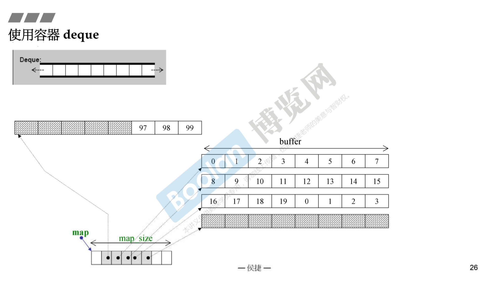
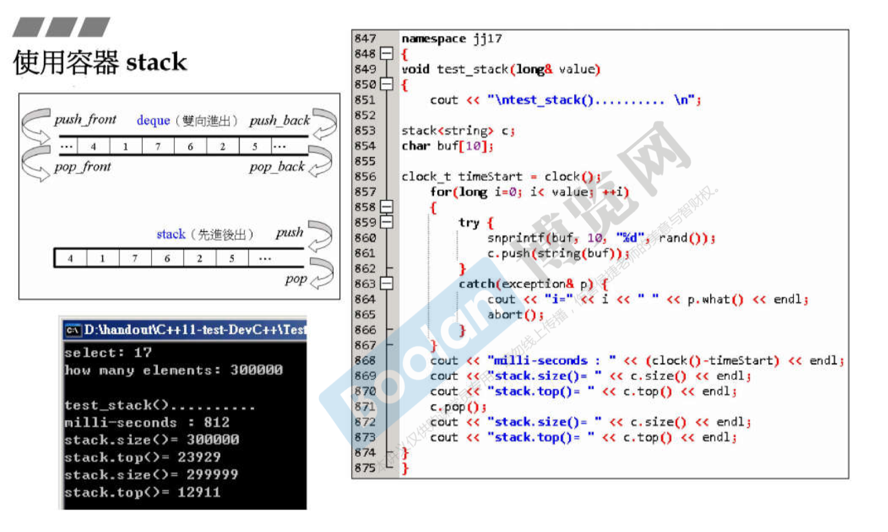
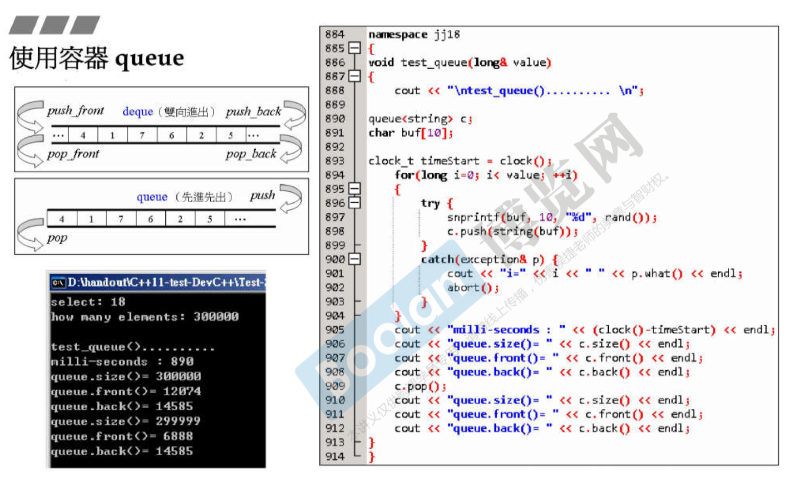
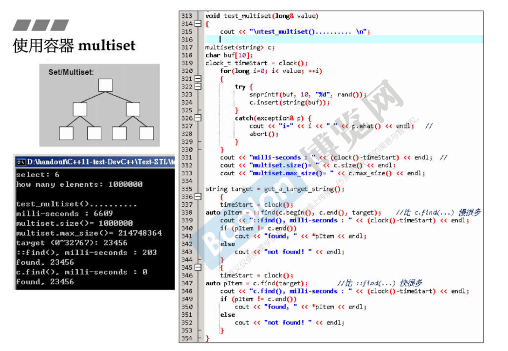
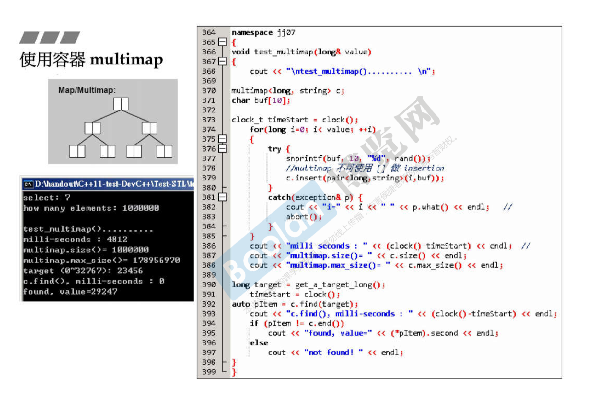
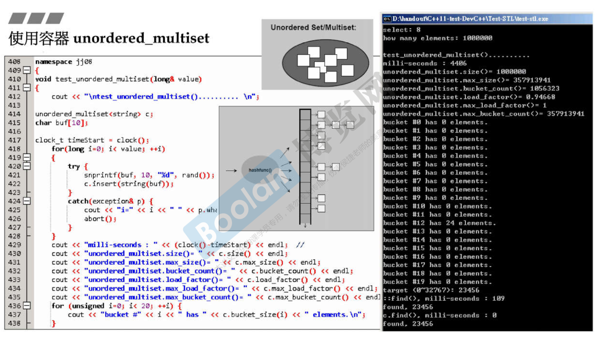
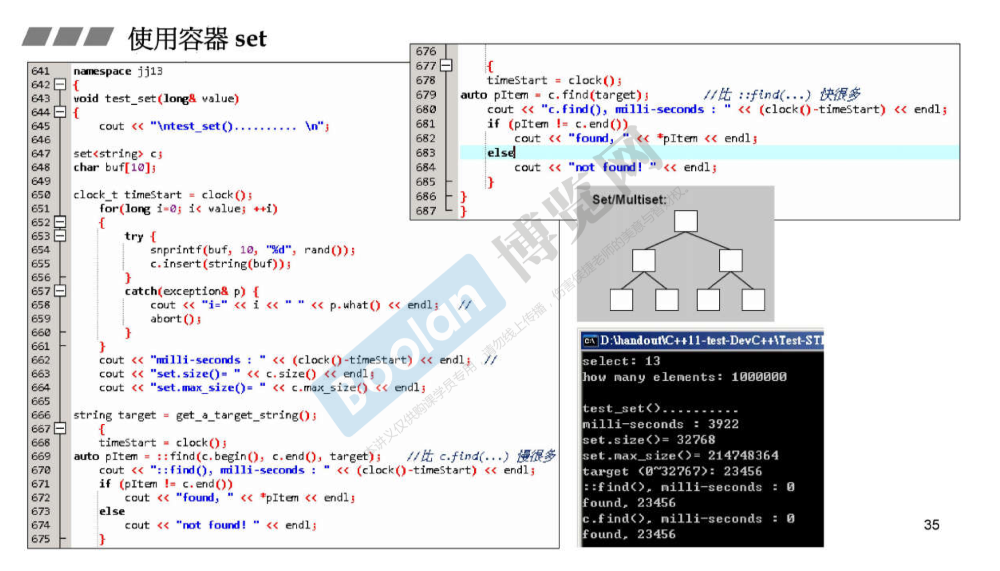

## STL

1. STL体系结构

   容器是前闭后开区间，迭代器相当于一个指针，每个容器内的指针都不一样。

   ```c++
   Container<T> c;
   // 每个容器内的指针类型都不一样
   Container<T>::iterator ite = c.begin();
   //c.end()指向数组最后一个元素的后面位置
   for(; ite!=c.end(); ++ite) {...}
   ```

   ```c++
   // c++ 11
   vector<int> vec = {1,2,3};
   for(auto e: vec) {...}
   ```

2. 容器结构分类

   + 序列式容器 方便查找
   + 不定序容器
   
3. vector array list forward_list

   ```c++
   forward_list<string> c;
   c.sort(); // 自带排序算法
   c.push_front(); // forward_list只能在前面加
   ```

4. deque

   ```c++
   deque<string> c;
   c.push_back(a);
   c.front();
   c.back();
   ```

   

5. stack

   

6. queue

   

7. multiset

   

8. multimap

   

9. unordered_multiset

   

10. unordered-mult-map

    

11. set

    

12. map

    

13. 使用分配器