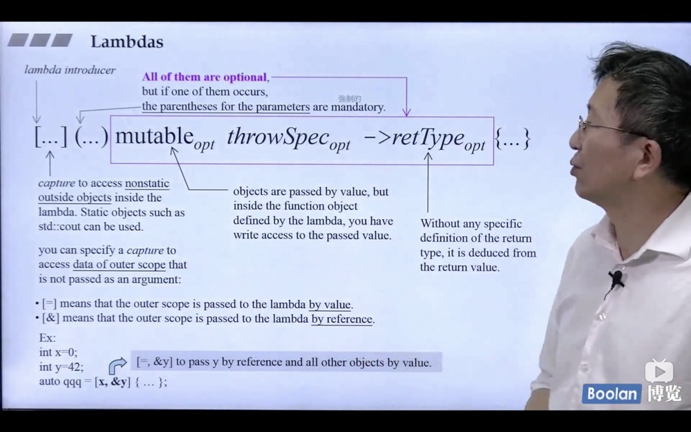
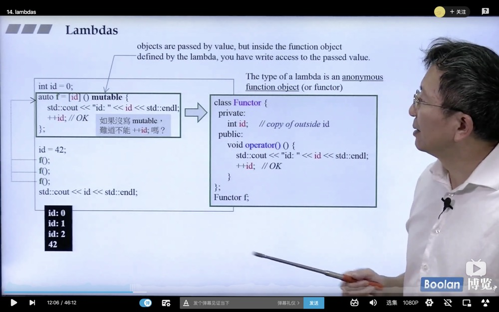
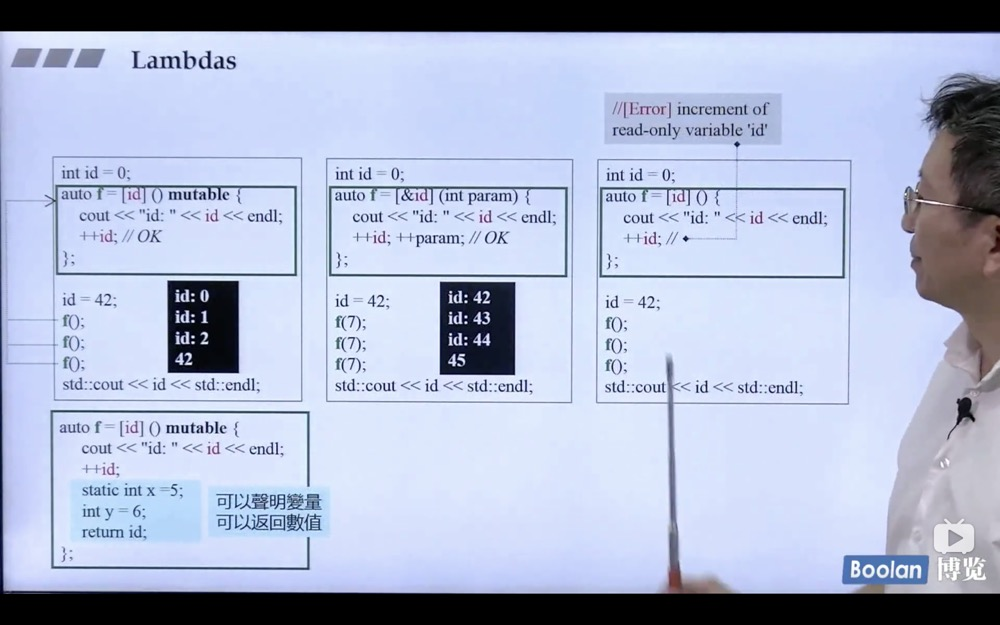

### C++11/14新特性

1. variadic-templates

2. Space in Template Expressions

   ```c++
   vector<list<int> > 在每个版本都适用
   vector<list<int>>  c++11后可以
   ```

3. nullptr and std::nullptr_t

   ```c++
   // C++11之后指针可以用 nullptr代替 0 or NULL
   void f(int);
   void f(void*);
   f(0); // call f(int)
   f(NULL); // call f(int) if NULL is 0 ambiguous
   f(nullptr); // call f(void*)
   ```

4. auto

   ```c++
   // #1 c++11 you can declare a var or an object without specifiying type by using auto
   auto i = 42;
   double f();
   auto d = f();
   // #2 auto用于2种情况 第一种是type太长 另一种是复杂的表达式 lambda 
   vector<int> v;
   // vector<int>::iterator pos;
   // pos = v.begin();
   auto pos = v.begin();
   auto l = [](int x) -> bool{}
   ```

5. Uniform Initialization (一致性初始化)

   > 原理: 编译器看到大括号 {t1,t2,tn}变做出一个 Initializer_list<T> 他关联到一个array<T,n> 调用ctor的时候 array内的元素被编译器被逐一赋值给ctor
   >
   > 但如果参数参数是个Initializer_list<T> 那就将参数打包直接发给函数

   ```c++
   // 如何初始化一个对象或变量，c++11 之前 新手很容易困惑 初始化可能发生在() {} =操作符
   // c++11 后统一一个方法 用{}
   int a[] = {1,2,3,4};
   vector<int> v{2,3,4,5,6};
   vector<string> city {
     "New York", "London", "Beijing"
   };
   comlex<int> c{4.0, 3.0}; // 等价于 c(4.0, 3.0);
   
   // c++ 11 之前
   Rect r1 = {3,7,&area};
   Rect r1(3,7,&area);
   ```

6. Initializer Lists

   ```c++
   int i; // i没有定义初值
   int j{}; // j定义初值为0
   int* p; // 指针p没有初值
   int *q{}; // 指针q的初值是nullptr
   ```

7. [initializer_list<>](https://github.com/yangsoon/cpptest/blob/master/c%2B%2B11%3A14/initializer-list.cpp) 

8. array

   ```c++
   // stl源码剖析部分细看
   ```

9. explicit for ctors taking more than one argument

10. ranged-based for statement 同上部分

    ```c++
    for(decl : coll) {
      statement
    }
    // 等价于下面
    for(auto pos = coll.begin(), end=coll.end(); pos!=end; ++pos) {
      decl = *pos
        statment
    }
    ```

    ```c++
    for(int i : {1,2,3,4,5,1,3}) {
      std::cout << i << ' ';
    }
    for(auto e : v) {
      std::cout << e << " ";
    }
    for(auto& e: v) {
      e *= 3;
      std::cout << e << " ";
    }
    ```

11. [=default, =delete](https://github.com/yangsoon/cpptest/blob/master/c%2B%2B11%3A14/equal-default-delete.cpp) 配合[拷贝构造](https://github.com/yangsoon/cpptest/blob/master/c%2B%2B/string.h#L39)和[拷贝赋值](https://github.com/yangsoon/cpptest/blob/master/c%2B%2B/string.h#L50) 一起食用

    > 对于一个空的class c++编译器处理之后就会不在是一个空的class 因为编译器会为这个class添加
    >
    > 1. copy ctor 
    > 2. copy assignment operator(=) 
    > 3. dtor 
    >
    > 就是Big Three 如果你没有声明ctor 编译器会为你声明一个default ctor且都是public inline的

    目的：是为了在这些函数中添加一些默认的行为，比如在ctor中调用父类的ctor或者dtor中调用父类的dtor

    ```c++
    class Empty{}; ==>
    class Empty{
    public:
      // Big Three
      Empty() {...}
      ~Empty() {...}
      Empty(const Empty& e) {...} // 默认行为是一个位一位的拷贝
      Empty& operator-()(const Empty& e){...}
    }
    ```

    如果一个类中包含指针对象 就需要自己实现 Big Three

12. [No-Copy and Private-Copy](https://www.bilibili.com/video/BV1p4411v7Dh?t=1596&p=9)

13. Alias Template(template typedef) [视频地址](https://www.bilibili.com/video/BV1p4411v7Dh?t=1596&p=10) (太难了 回头再看看)

    ```c++
    template<typename T>
    using Vec = std::vector<T, MyAlloc<T>>;
    // 不能对Vec做特化
    Vec<int> coll; => std::vector<int, MyAlloc<int>> coll;
    ```

14. [template template parameter+alias template](https://github.com/yangsoon/cpptest/blob/master/c%2B%2B11%3A14/template-template-parameter.cpp) [视频地址](https://www.bilibili.com/video/BV1p4411v7Dh?t=1596&p=11) (有点劝退了.... 老师最后的一笑深藏功与名)

15. Type Alias

    ```c++
    // typedef void(*func)(int, int);
    // func是一个类型 是一个函数指针
    // 和typedef没有区别
    using func = void(*)(int, int);
    
    void example(int, int) {};
    // 函数名就是一个函数指针
    func fn = example;
    ```

16. `using`

    ```c++
    // #1 using namespace std; using std::count;
    // #2 声明成员函数 Base::test
    // #3 用于alias
    ```

17. `noexcept`

    > 在函数后面加上 noexcept 说明保证函数一定不会产生异常

    ```c++
    void foo() noexcept;
    void foo() noexcept(true); // 表明在上面条件下不会丢异常
    ```

18. `override`

19. `final`

    ```c++
    struct Base1 final(); // 表示不允许其他类继承
    struct D: Base1{};// error
    
    struct Base2{
      virtual void f() final; // 不允许被重写
    }
    
    struct D:Base2 {
      void f(); // error
    }
    ```

20. `decltype`

    > 这个关键字的功能类似 typeof 返回对象的类型

    ```c++
    template<typename T1, typename T2>
    auto add(T1 x, T2 y) -> decltype(x+y);
    
    // error 因为编译到decltype(x+y)的时候 编译器不知道xy是什么东西
    template<typename T1, typename T2>
    decltype(x+y) add(T1 x, T2 y);
    ```

    ```c++
    // auto cmp由编译器推导出类型
    auto cmp = [](const Person& p1, const Person& p2) {
      	return p1.lastname() > p2.lastname();
    }
    // set需要传递一个函数类型 用decltype可以得出
    std::set<Person, decltype(cmp)> coll(cmp);
    ```

21. `lambda`
    
    > lambda没有构造和赋值函数
    
    ```c++
    auto l = [] {
    	strd::cout << "hello lambda" << std::endl;
    }
    l();
    ```
<p align =“center”>
    	
</p>

    1. [...]中传递外部的变量

   > [&]传引用 mutable表示放在[]里面的变量可变
       >
       > [=]表示默认接收外界的所有变量

   <p align =“center”>
       	
       </p>
   <p align =“center”>
       	
       </p>


22. Variadic Template 进阶 [视频地址](https://www.bilibili.com/video/BV1p4411v7Dh?t=1596&p=11) (以后看看)

23. [右值引用](https://github.com/yangsoon/cpptest/blob/master/c%2B%2B11%3A14/rvalue-reference.cpp) [知乎](https://www.zhihu.com/question/22111546/answer/30801982)

    > 右值引用是新型的引用类型 帮助避免不必要的复制

    当赋值的右手边是一个右值的时候 左手边的接受端可以偷右手边的资源而不需要执行allocation动作

    Lvalue 可以出现在 = 左边 (左值表示变量的地址)

    Rvalue 只能出现在 = 右边 (右值表示存储的真实的值)

    类的临时对象是一个右值,临时变量一定被当成右值，因为临时对象创建之后 不会再被使用 所以直接把右值数据引用给别的变量，有时候一个左值在后面不会被用到，那么就可以使用move语义 把左值转成右值。

    **右值引用我的理解是编译器提供了一个接口 允许你进行赋值的时候直接使用右值的内存空间(其实就是将指针指向这块空间，当然在进行copy ctor和copy asgn的时候你需要自己实现操作，因为当你实现了右值引用的机制后编译器会自动调用你实现的函数)，对于一些左值 但是如果在接下来的scope中你用不到了 在进行赋值的时候可以使用move语句将左值转变为右值，因为左值后面用不到了所以你可以把左值指向的内存的指针给删除(注意一定要删除指针，因为当这个左值的scope结束后，编译器会调用析构函数，如果没有删除指针，会把你move出去的这块内存给删除所以就造成了错误)**

24. hashtable